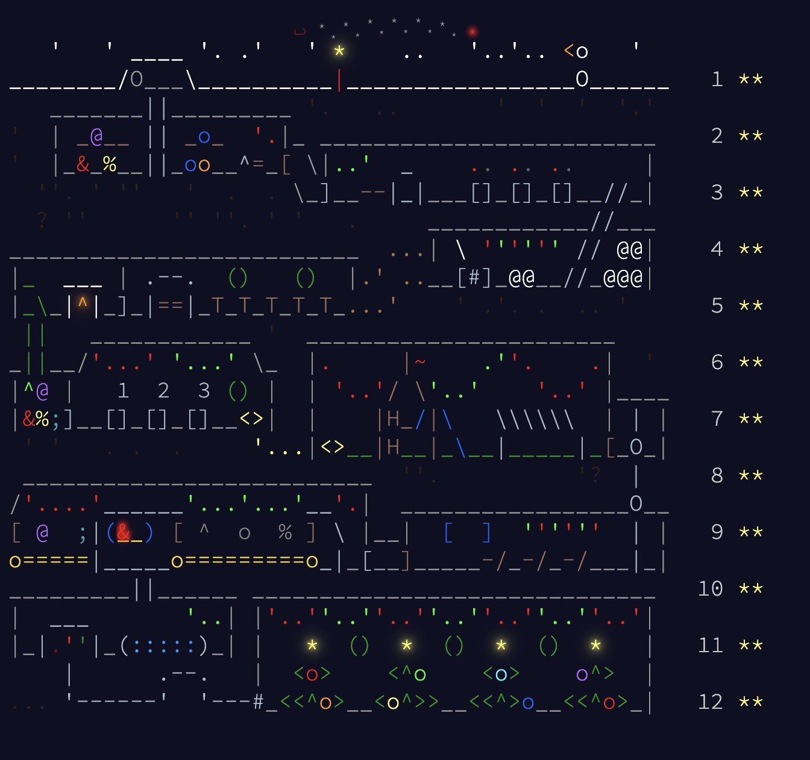

# 🎄 Advent of Code 2025 Solutions

This repository contains my solutions for Advent of Code 2025. I focussed on solving problems quickly at first which sometimes resulted in messy code. Before committing, I always clean up and improve the code. If I find a better way later, I update the solution.

---

## 📝 Commit Message Style Used
- `<approach used> | <commit msg>` (if required)

---

## Solution Approaches by Day

### Day 1
- **Part 1:** Brute force (inputs are small)

---

### Day 2
- **Part 2:** Used string algorithms. End of the day found a shortcut for p2 `s == (s+s)[1:-1]` for checking rotations. Updated the solution.
- Another one-liner that can be used: `s[:idx] * reps == s` for `idx` in `(1, mid)`.

---

### Day 3
- **Part 2:** For long input lists, sort positions for each digit and use binary search to find the first occurrence. Other approaches:
  - Naive greedy linear scan per digit: O(k * 10 * n)
  - Dynamic Programming (DP): O(n * k) time, O(n * k) space
  - Binary search with `bisect_left`: O(k * 10 * log n)
  - Monotonic stack (best): O(n) time, O(k) space
  - *k* is usually 12; if very large, stack solution is optimal
- Initially used greedy scan, then replaced with stack solution. For small *k* and large *N*, binary search is more efficient; for large *k*, stack wins.

---

### Day 4
- Straightforward grid neighbor-count

---

### Day 5
- **Part 2:** Sorted interval merging with a linear sweep

---

### Day 6
- Column-wise parsing. Note: Sublime was stripping spaces, causing issues for part 2. Changed editor settings to preserve spaces.

---

### Day 7
- Straightforward bottom-up DP

---

### Day 8
- Connected components in a graph. Used DFS during contest, later refactored to Disjoint Set Union (DSU) for efficiency.

---

### Day 9
- Orthogonal polygon. Solutions implemented both with and without the `shapely` library. Used matplotlib to visualise

---

### Day 10
- Bitmask brute force for p1, scipy ILP for p2

---

### Day 11
- Top Down DP with DFS in DAG

---

### Day 12
- Trivial bounds check for NP-Complete bin packing problem.
  - Inputs are designed to avoid true NP-complete complexity.
  - Wasted a lot of time trying to implement complex heuristics
  - Lesson: Whenever faced with an NP-Complete puzzle, always analyze input constraints for possible simplifications.

---

  

